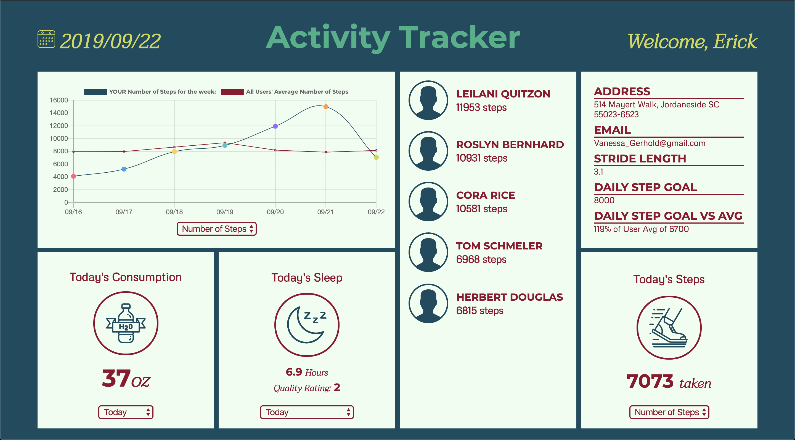
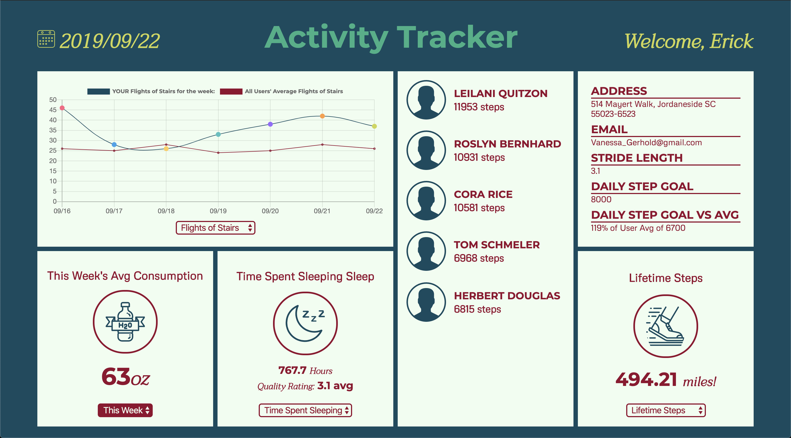

# Activity Tracker

## Screen Grabs of Finished Product

## General info

Activity tracker is an application that shows pertinent metrics, and trends for each user's _sleep, hydration,_ and _steps_ data repositories. The application uses these data repositories, and then (using methods on various object Classes) compiles and calculates specifics, so that all the user's information can be displayed on the page's widgets in a meaningful way. This project was created as a paired programming exercise in Front End Engineering Module 2 at _Turing School of Software and Design_ This project demonstrates a comprehension of __TDD__ _test driven development_, __object oriented programming, data structure__ and __analysis__, as well as DOM creation around the analyzed data.

## Learning Goals

* Test Driven development
* Object Oriented Programming
* DRY and Re-useable Code
* Data Analysis

## Setup

1. Navigate to the project repository (repo) on GitHub (https://github.com/infamouskeyduster/fitlit-starter-kit). Then, click the __green__ button that reads _'clone or download'_.
2. Navigate to the CLI (Terminal) on your machine and enter: `git clone [remote-address] [what you want to name the repo]` – replace what is in the [] with the cloned URL and whatever you would like to call the repo.
3. Once you have cloned the repo, change into the directory and install the project dependencies. Run `npm install` to install project dependencies.
4. Run `open src/index.html` in the terminal to see the HTML page (you should see some boilerplate HTML displayed on the page).

## Technologies

Project is created with:
* HTML
* CSS
* JavaScript
* Chart.js
* _Testing Suite:_ Mocha & Chai
